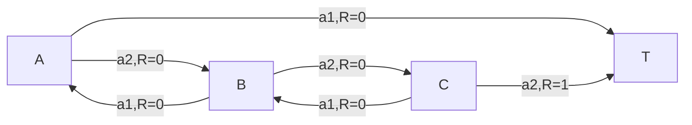

## Problem 1

| Method                     | $V(A)$ | $V(B)$        | $V(C)$        |
| -------------------------- | ------ | ------------- | ------------- |
| First-Visit MC             | $0$    | $\frac{1}{3}$ | $\frac{1}{2}$ |
| Incremental First Visit MC | $0$    | $0.09$        | $0.09$        |
| TD(0)                      | $0$    | $0.009$       | $0.091$       |
| 2-Step TD                  | $0$    | $0.09$        | $0.09$        |

$$
\mathcal{P}^{a_1}=\begin{pmatrix}
    0 & 0 & 0 & 1 \\
    1 & 0 & 0 & 0 \\
    0 & 1 & 0 & 0 \\
    0 & 0 & 0 & 1
\end{pmatrix},
\mathcal{P}^{a_2}=\begin{pmatrix}
    0 & 1 & 0 & 0 \\
    0 & 0 & 1 & 0 \\
    0 & 0 & 0 & 1 \\
    0 & 0 & 0 & 1
\end{pmatrix},
$$

$$
\mathcal{R}^{a_1}=\begin{pmatrix}
    0 \\
    0 \\
    0 \\
    0
\end{pmatrix},
\mathcal{R}^{a_2}=\begin{pmatrix}
    0 \\
    0 \\
    1 \\
    0
\end{pmatrix}
$$

$$
\begin{aligned}
    V(A)&=\frac{1}{2}V(B)+\frac{1}{2}V(T)\\
    V(B)&=\frac{1}{2}V(A)+\frac{1}{2}V(C)\\
    V(C)&=\frac{1}{2}V(B)+\frac{1}{2}(1+V(T))\\
    V(T)&=0
\end{aligned}\implies\begin{aligned}
    V(A)&=\frac{1}{4}\\
    V(B)&=\frac{1}{2}\\
    V(C)&=\frac{3}{4}\\
    V(T)&=0
\end{aligned}
$$

注意到不同的方法的计算难度有很大的差别，计算出的价值函数也有很大的差别。在理论上上面的所有方法都能收敛到真实的价值函数，但是由于参与估计的样本量极少，而不同方法侧重于样本的不同方面，从而导致估计的结果不同。由于不知道真实的价值函数，也不知道具体的应用情形，很难说哪种方法的收敛速度会更快。能发现的是，在样本量小的情况下，由于 $\alpha$ 设置的很低，基于更新步长的方法明显更加迟钝，估计的价值函数偏小。

## Problem 2

$$
v_\pi(s)=0.9v_\pi(s)+0.1(1+v_\pi(t))\implies v_\pi(s)=1
$$

记发生 $k$ 次 "左" 动作的轨迹出现的概率为 $P_k$, 易知

$$
P_k=\begin{cases}
    \frac{1}{2} & k=0\\
    0.1\frac{0.9^{k-1}}{2^k} & k=1,2,\cdots
\end{cases}
$$

样本值

$$
F_{IS}G_0\bigg|_k=\begin{cases}
    0 & k=0 \\
    2^k & k=1,2,\cdots
\end{cases}
$$

期望

$$
\begin{aligned}
    \mathbb{E}[\hat{G}]&=\sum_{k=0}^{\infty}P_kF_{IS}G_0\\
    &=\sum_{k=0}^{\infty}0.1\frac{0.9^{k-1}}{2^k}\cdot 2^k\\
    &=0.1\lim_{k\to\infty}\frac{1-0.9^k}{1-0.9}\\
    &=1
\end{aligned}
$$

$$
\begin{aligned}
    \mathbb{E}[\hat{G}^2]&=\sum_{k=0}^{\infty}P_kF_{IS}^2G_0^2\\
    &=\sum_{k=0}^{\infty}0.1\frac{0.9^{k-1}}{2^k}\cdot 4^k\\
    &=\frac{1}{9}\sum_{k=0}^{\infty}1.8^k\\
    &=+\infty
\end{aligned}
$$