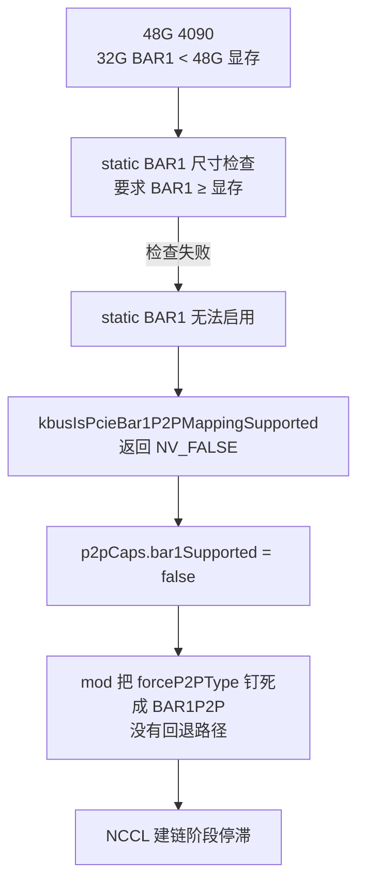
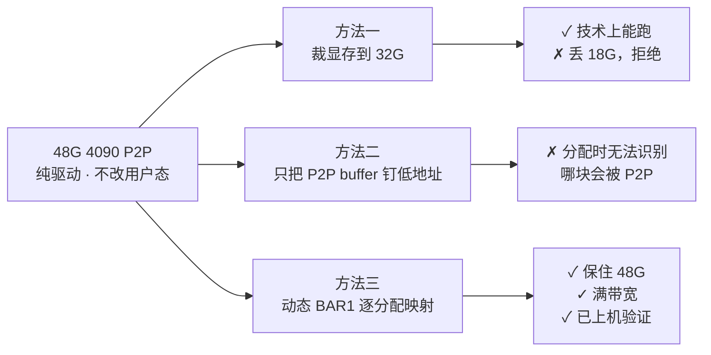
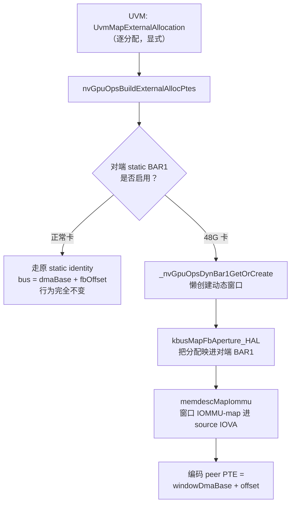
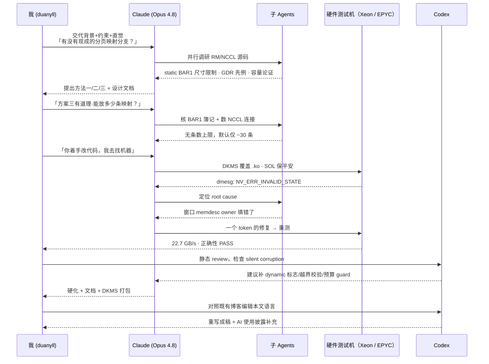

手头攒了一批 48G 显存的魔改 4090。单卡推理一切正常，换成多卡训练，NCCL 却停在初始化阶段：社区里给消费卡解锁 PCIe P2P 的经典 mod，在这种卡上并不能工作。排查两天后，我改用动态 BAR1 逐分配映射，在不修改用户态的前提下保住了全部 48G 显存，P2P 带宽也能跑满 PCIe Gen4 x16。本文记录问题的成因、驱动修改和上机结果。

文末另有一节「AI 使用披露」。这套方案从源码调研、实现到上机排错，大部分具体工作由我指挥 Claude 完成；之后又由 Codex 做过代码审查和本文的文字编辑。与其把这些过程折叠成一句「在 AI 辅助下完成」，不如把人和 agent 各自做了什么写清楚，至少比假装几十万行驱动都是某个周末随手读完的可信一些。


**免责声明**：这是一个非官方的社区魔改，与 NVIDIA 无关，不提供任何担保。修改内核模块不会让你失去魔改 48G 4090 卡本不存在的官方保修。涉及直接覆盖内核模块的操作，请自行做好备份并承担风险。


## TL;DR



- **背景**：社区给 4090/5090 解锁 P2P 的做法，是把 GH100 的 **static BAR1 identity 映射** 移植过来。它硬依赖 `BAR1 窗口 ≥ 显存`。
- **困难**：使用泄露 VBIOS 的 48G 4090 只有 **32G BAR1 / 48G 显存**。由于 `BAR1 < FB`，static BAR1 无法启用，P2P 能力位始终为 false，NCCL 会卡在建链阶段。
- **方案**：不再 identity-map 整块显存。每当 peer 映射一块分配时，调用现有的动态 BAR1 机制（`kbusMapFbAperture`），将这块分配单独映射进对端 BAR1；GMMU 提供的一层地址翻译，使位于 32G 以上的显存也能通过 32G BAR1 窗口访问。NCCL 默认只共享几十至数百 MB，容量不是问题。
- **结果**：方案在 Intel Xeon 和 AMD EPYC 7002 两套平台上均通过数据校验，并保留全部 48G 显存。8 卡 Xeon 平台的 DDP 提速约 **1.7×**；4 卡 EPYC 7302 平台受 sysmem staging 拖累更严重，NCCL all-reduce busbw 从 **4.1 提升到 25.15 GB/s（6.1×）**，DDP 从 **1203.7 降到 109.5 ms/step（约 11×）**。
  

## 背景：消费卡是怎么解锁 P2P 的

### 前人的工作

数据中心卡（例如 A100、H100）之间可以通过 PCIe 或 NVLink 进行 GPU 到 GPU 的点对点（peer-to-peer, P2P）读写。NCCL 的 all-reduce 因而可以绕开 CPU 和系统内存，带宽和延迟都更理想。GeForce 的驱动则禁用了这项能力；硬件并没有明显意见，产品线划分有。

[geohot（tinygrad）](https://github.com/tinygrad/open-gpu-kernel-modules) 最早发现，只要 patch 开源的 `nvidia-open` 内核模块，把 GH100（Hopper）的 PCIe P2P 处理逻辑移植到 AD102（4090）和 GB202（5090）上，就能为消费卡解锁 P2P，而且不用修改用户态：CUDA 和 NCCL 保持原样，`cudaDeviceCanAccessPeer` 会直接返回 true，NCCL 也就能选择 P2P 路径。这套做法后来经过社区反复验证。本项目沿用了 geohot 原版、后续精简版以及 [nimlgen 增加 5090 支持的一系列 fork](https://github.com/aikitoria/open-gpu-kernel-modules)。harrychen 的 [RTX 5090 P2P 实践](https://harrychen.xyz/2026/03/22/enable-pcie-p2p-on-rtx-5090/) 还详细记录了带宽、ACS 和 `NCCL_P2P_LEVEL` 等实际问题。

我此前也处理过这套 mod 的打包问题，目标是做成可以直接 `apt install` 的 DKMS 包。真正麻烦的是如何可靠地替换 `ubuntu-drivers` 安装的预编译内核模块。改用 Debian 和 NVIDIA 官方 DKMS 驱动包后，只需给源码打 patch，事情便正常了许多。打包方法放在后文说明。

### static BAR1 identity 映射的原理

要理解为什么这套方案在 48G 卡上会崩，得先看它到底是怎么工作的。

GH100 这套 P2P 机制（不是早期的 mailbox 方案）本质上是把对端 GPU 的整块显存视为一段挂在 BAR1 物理基址上的「系统内存」。BAR1 是 GPU 在 PCIe 地址空间中开放的窗口（aperture）；CPU 或其他 PCIe 设备访问这个窗口，最终读写的是 GPU 显存。

patch 过的代码里，source GPU 给每个 peer 页填的 PTE 物理地址就是一条极简的线性公式：

```
peer_bus_addr = bar1BusAddr + fbPhysOffset
```

其中 `bar1BusAddr = gpumgrGetGpuPhysFbAddr(peerGpu)` 是对端 BAR1 的 PCIe 基址，`fbPhysOffset` 是这块显存在对端显存里的物理偏移。再把 GMMU 的 `PEER` aperture 改写成 `SYS_NONCOH`，让地址域指向系统内存。于是 source GPU 一发 DMA，PCIe 就把它路由到对端 BAR1 窗口，命中对端显存的对应位置。

整个方案依赖 static BAR1：驱动需要一次性将 `[0, 整块显存)` identity-map 到 BAR1 窗口，使 BAR1 中的偏移 `x` 始终对应显存中的偏移 `x`。因此，只有在 **BAR1 窗口 ≥ 显存容量** 时，这个映射才有可能成立：

```c
// kern_bus_gh100.c: kbusIsPcieBar1P2PMappingSupported_GH100
if (!kbusIsStaticBar1Enabled(pGpu0, ...) || !kbusIsStaticBar1Enabled(pGpu1, ...))
    return NV_FALSE;   // 只要有一端没开 static BAR1，P2P 能力位直接 false
```

而 `kbusIsStaticBar1Supported_TU102` 里写死了尺寸检查：`FORCE_ENABLE` 模式要求 `BAR1 ≥ client 可见显存`，`AUTO` 模式要求得更多（还要加上 doorbell、console、512MB padding）。这个检查没有 regkey 能绕过。

普通 4090 是 24G 显存 / 24G BAR1，5090 是 32G / 32G，RTX Pro 和 GH100 的 BAR1 还更宽裕，都满足 `BAR1 ≥ FB`，所以原方案可以正常工作。

### 48G 4090 是个什么东西

问题出在一种特殊的卡上。NVIDIA 曾泄露过一版能让 AD102 使用 48G 显存的 VBIOS；第三方再配合复用 RTX 3090 Ti 的 PCB 设计（正反面共 24 颗显存），便能做出被 NVIDIA 原版驱动完整识别的 **48G 4090**。对于单卡大模型推理，多出来的 24G 显存很有实际价值。

但这版 VBIOS 只开放了 **32G BAR1 窗口**，目前也看不到将其改成 64G 的可行方法；修改 BAR1 大小需要绕过 VBIOS 签名，基本可以到此为止。第一次尝试多卡训练时，问题随即出现：



`BAR1 < FB` 导致 static BAR1 在任何模式下都无法启用，P2P 能力位始终为 false；与此同时，mod 又把 `forceP2PType` 固定为 BAR1P2P，没有回退路径，NCCL 因此一直停在建链阶段。这就是「卡在初始化」的具体原因。

核心矛盾很简单：显存有 48G，能够暴露给 peer 的 BAR1 窗口却只有 32G。

```{=latex}
\begin{tikzpicture}[
    font=\footnotesize,
    lbl/.style={font=\scriptsize}
]
% 48G FB column
\draw[thick] (0,0) rectangle (2.6,7);
\node[lbl, rotate=90] at (-0.5,3.5) {48G FB};
\draw[dashed, thick, red] (0,4.667) -- (2.6,4.667);
\node[lbl, red] at (1.3,4.95) {32G line};
\fill[blue!18] (0,0.6) rectangle (2.6,1.3);
\node[lbl] at (1.3,0.95) {alloc A (low)};
\fill[orange!35] (0,5.6) rectangle (2.6,6.3);
\node[lbl] at (1.3,5.95) {alloc B ($>$32G)};

% BAR1 window column
\draw[thick] (7,0) rectangle (9.6,4.667);
\node[lbl, rotate=90] at (10.1,2.3) {32G BAR1 window};
\node[lbl] at (8.3,-0.55) {peer PCIe bus address};

% arrows
\draw[-{Latex}, thick, blue] (2.6,0.95) to[out=0,in=180] (7,0.95);
\node[lbl, blue] at (4.8,1.35) {bus $=$ base $+$ off$_A$};

\draw[-{Latex}, thick, red] (2.6,5.95) to[out=0,in=180] (9.9,5.6);
\node[lbl, red] at (5.0,6.35) {bus $=$ base $+$ off$_B$};
\node[lbl, red, align=center] at (8.9,5.2) {overshoots\\the window};

\end{tikzpicture}
```

分配 A 位于低 32G，`base + offsetA` 仍在窗口内；如果分配 B 的物理偏移超过 32G，`base + offsetB` 就会越过 BAR1 窗口，编码出的总线地址不再指向有效映射。接下来的选择只有数据损坏或设备挂死，两者都不适合作为回退机制。

我最初打算沿用传统做法。显存大于 BAR1 并不是新问题，早期显卡就需要由驱动维护按需 pin 和 map 的分页映射。32G 相对 48G 也不算太小，即使需要换页，频率和性能或许仍能接受。于是首先要确认：NVIDIA 驱动中是否已有可以复用的分页映射路径？

## 走过的两条弯路

在确定最终方案之前，我和 Claude 评估了三个方向，并分别留下了设计文档。前两个方向要么代价过高，要么在现有约束下无法实现；不过，它们也把问题边界收窄到了足以找到第三条路，因此这里一并记录。



### 方法一：把显存裁到 BAR1 以内

既然 5090（32G BAR1 + 32G 显存）能够正常工作，最直接的办法就是把 48G 4090 对外提供的可分配显存裁到 32G 以内。这样可以满足 static BAR1 的尺寸要求，现有 mod 无需修改。

这甚至不需要改源码，两个 NVIDIA 官方 regkey 就够了：

```
# /etc/modprobe.d/nvidia-48g-p2p.conf
options nvidia NVreg_RegistryDwords="OverrideFbSize=30720;RMForceStaticBar1=1"
```

`OverrideFbSize`（单位 MB）会在可用显存区顶部插一段 reserved region，把它从 PMA 可分配池里移除，于是 `client 可见显存` 降到 32G 以下；`RMForceStaticBar1=1` 则强制走 `FORCE_ENABLE` 分支（`AUTO` 因为看的是没被裁的顶部 limit 仍然不过）。

这个方案在技术上可行，但我肯定不会接受。购买 48G 卡的目的就是使用这 48G 显存；为了启用 P2P，再用 regkey 把其中约 18G 隐藏起来，账面上的不等式是满足了，机器并不会因此便宜。`OverrideFbSize` 在这里最多是一个诊断工具，可以用来验证 static BAR1 的尺寸假设，不是保底方案，更不会进入实际部署。我让 Claude 把这一方向整理成文档后，继续寻找不需要裁显存的方案。

### 方法二：只把「会被 P2P 共享」的内存钉在低地址

方法一的问题在于裁掉了整个 PMA 的一部分，而本机访问自己的显存并不经过 BAR1，只有 P2P 访问需要它。由此可以考虑另一种方案：仍让 PMA 管理全部 48G 显存，仅将以后会被 peer 访问的分配限制在低 32G，static BAR1 也只覆盖这一区域。

驱动侧几乎具备所需的全部机制：peer 映射本来就按分配（per-allocation）经过 UVM 的 `UVM_MAP_EXTERNAL_ALLOCATION`；static BAR1 区可以缩小；分配位于 static 区外时已有 dynamic 回退；将分配限制到低地址的原语（`PMA_ALLOCATE_SPECIFY_ADDRESS_RANGE` / `rangeLo/rangeHi`）也已经存在。

问题在于，物理分配发生时，驱动不知道这块内存以后是否会被 P2P 共享。可共享的 `cuMemCreate` 和普通 `cudaMalloc` 经过相同的分配路径，参数结构中没有 export、shareable 或 ipc 字段。「可导出」是在分配完成后通过 `DupObject` 附加到物理内存上的独立对象，相关检查也到导出时才发生。内核没有收到意图，自然也没有必要猜测用户几分钟后的决定。

要补充这一信号，只能修改闭源的 CUDA 用户态，或者让内核在分配阶段得到目前并不存在的 export 意图。两者都违背「不改用户态，只 patch 驱动」的约束，因此方法二不能成立。不过，对方法二的调查确认了两项重要事实，也直接引出了最终方案。

## 方法三：动态 BAR1 P2P

### 改成逐分配预映射

方法二确认了两件事：被 peer 共享的集合很小，NCCL 默认只暴露自己的传输 FIFO，通常只有几十至数百 MB；这些分配还会被显式地逐个映射，CUDA/NCCL 通过 `UvmMapExternalAllocation` 明确告诉驱动要映射哪一块，并不依赖缺页触发。

因此，没有必要将整块显存 identity-map 到 BAR1。可以把映射粒度改为单个分配：

> 每次 peer 要映射某个分配时，用现成的**动态 BAR1 机制**（`kbusMapFbAperture`）把**这一个分配**映射进对端 GPU 的 BAR1，拿到它的 BAR1 总线地址，再让 source 的 peer PTE 指向这个动态窗口的地址。

这避开了透明分页在 inbound BAR1 上无法可靠实现的问题。对端发来的写是 posted transaction，丢失后不能重放；读请求又受 PCIe completion timeout 限制，来不及完成 fault、换页和重试。动态方案不依赖缺页，而是在收到显式请求时 eager 地预先建立映射。硬件不会因为驱动稍后补好了页表，就体谅之前那次传输。

### 为什么它能吃下 >32G 的高地址分配

动态方案与 static 方案的区别在于地址中间多了一层翻译：

- **static BAR1**：`bus = BAR1base + fbPhysOffset`。分配物理偏移一旦 >32G，总线地址就越窗 → 损坏。所以硬要求 `BAR1 ≥ FB`。
- **dynamic BAR1**：将分配映射到一个偏移始终位于 `0..32G` 的 BAR1 VA 槽，再由 GMMU PTE 把这个 BAR1 VA 翻译到 48G 显存中的任意物理页。总线地址 `= BAR1base + bar1VAoffset`，始终位于 32G 窗口内；peer 的 DMA 到达 BAR1 后，再由 GMMU 定向到高地址显存页。

借助 GMMU 这层间接，分配可以位于 48G 显存中的任意位置；需要小于 32G 的只是同时映射的 BAR1 VA 总量。NCCL 默认约为 180MB。

```{=latex}
\begin{tikzpicture}[
    font=\footnotesize,
    lbl/.style={font=\scriptsize}
]
% 48G FB
\draw[thick] (0,0) rectangle (2.4,7);
\node[lbl, rotate=90] at (-0.5,3.5) {48G FB};
\draw[dashed, red] (0,4.667) -- (2.4,4.667);
\fill[orange!35] (0,5.6) rectangle (2.4,6.3);
\node[lbl] at (1.2,5.95) {alloc B ($>$32G)};

% 32G BAR1 VA
\draw[thick] (5,0) rectangle (7.4,4.667);
\node[lbl, rotate=90] at (7.85,2.3) {32G BAR1 VA};
\fill[green!30] (5,0.8) rectangle (7.4,1.4);
\node[lbl] at (6.2,1.1) {window W};
\node[lbl] at (6.2,-0.55) {W offset always $<$32G};

% GMMU indirection: W -> B
\draw[-{Latex}, thick, green!45!black] (7.4,1.1) to[out=20,in=-20] (2.4,5.95);
\node[lbl, green!45!black, align=center] at (10.3,3.6) {GMMU PTE\\remaps W to\\high FB page B};

% bus address arrow from source
\node[draw, thick, minimum width=2cm, font=\scriptsize] (src) at (6.2,6.3) {source GPU};
\draw[-{Latex}, thick, blue] (src) -- (6.2,1.4);
\node[lbl, blue, align=center] at (3.4,3.9) {peer PTE $=$\\base $+$ off$_W$\\(always in 32G)};

\end{tikzpicture}
```

### 复用 GPUDirect RDMA 的现有路径

驱动中已有一条经过长期使用的相似路径：GPUDirect RDMA / 第三方 P2P 会把单个显存分配映射进 BAR1，再将其 PCIe 总线地址交给调用方：

```
nvidia_p2p_get_pages          ← nvidia-peermem 调用
  → RmP2PGetPages
    → RmThirdPartyP2PBAR1GetPages
      → kbusMapFbAperture_HAL   ← 逐分配 BAR1 映射（就是我们要的原语）
      → 总线地址 = BAR1 base + BAR1 VA
```

这条路径按字节预算准入，即比较累计映射大小与 `BAR1 - 保留空间`，并不限制固定条数。BAR1 映射没有固定数组或 `MAX_*` 上限，页表也在显存中按需分配。GDR 的消费者是网卡，而这里的消费者是 peer GPU；需要复用的是同一套 `kbusMapFbAperture` 机制。

容量方面，AD102 的 BAR1 映射只受 32G VA 约束，足以容纳数千到上万条数 MB 的映射。我又根据 NCCL 2.30.7 源码核对了关闭 user-buffer 注册时的默认用量：

| 拓扑（PCIe，无 NVLink，registration 关） | 每 GPU 独立映射数 | 每 GPU 总字节 |
| ---------------------------------------- | ----------------- | ------------- |
| 2-GPU all-reduce (ring)                  | ~4                | ~24 MB        |
| 8-GPU all-reduce (ring)                  | ~16               | ~96 MB        |
| 8-GPU 同时跑 coll + a2a（典型默认）      | ~30               | ~180 MB       |

默认用量约为 30 条、180MB，与 32GB 的可用量相比仍有两到三个数量级的余量。

### 实现：在 static 与 dynamic 之间自适应

代码修改的核心，是在 `nv_gpu_ops.c` 中增加逐分配动态 BAR1 窗口，并用它编码 peer PTE。相关改动都带有 `METHOD3` 注释，便于检索。调用路径如下：



动态路径不能无条件启用。普通显卡的 static 区已经占用了 BAR1 VA，继续创建动态窗口会耗尽地址空间。因此，代码根据对端是否启用 static BAR1 选择路径：普通显卡保持原有行为，只有 `BAR1 < FB` 的 48G 卡使用动态窗口。

```c
// nv_gpu_ops.c —— orchestrator 里的自适应门禁
if (isBar1P2PSupported &&
    !kbusIsStaticBar1Enabled(pAdjustedMemDesc->pGpu,
                             GPU_GET_KERNEL_BUS(pAdjustedMemDesc->pGpu)))
{
    // 对端 BAR1 < FB（如 48G 4090）：把这一个分配单独映进对端 BAR1，
    // 拿到 source 可见的窗口 DMA base，用来编码 peer PTE。
    status = _nvGpuOpsDynBar1GetOrCreate(vaSpace->device->rmSubDevice,
                                         pMappingGpu, pAdjustedMemDesc->pGpu,
                                         pAdjustedMemDesc, hMemory, &dynBar1DmaBase);
    if (status != NV_OK) goto freeGpaMemdesc;

    // 显式的模式标志——不要用 dynBar1DmaBase != 0 反推（IOVA 0 也可能是合法地址）
    dynBar1Mapped = NV_TRUE;
}
```

PTE 编码也分为两条路径。动态窗口是连续的，第 `i` 页地址为 `窗口基址 + 分配内偏移`；static 模式保持原有实现：

```c
if (bDynBar1Mapped)
{
    // METHOD3（动态）：这个分配被单独映进了对端 BAR1，dynBar1DmaBase 是
    // 该窗口在 source 侧可见的基址。窗口连续，故第 i 页 = 基址 + 分配内偏移。
    if ((offset + size) > memdescGetSize(pMemDesc)) { /* 防御性越界拒绝 */ }
    for (i = 0; i < pteCount; i++)
        physicalAddresses[i] = dynBar1DmaBase + offset + i * (NvU64)mappingPageSize;
}
else
{
    // static identity 区（正常卡，BAR1 >= FB）：peer 地址 = 区基址 + FB 偏移
    kbusGetBar1P2PDmaInfo_HAL(pMappingGpu, pRemoteGpu, ..., &dmaBaseAddress, &dmaSize);
    // physicalAddresses[] 里已经是 FB 偏移，叠加区基址即可
}
```

动态窗口由 `_nvGpuOpsDynBar1Create` 创建，整体沿用 `third_party_p2p.c` 的做法，分为三步：

```c
// 1. 把分配映进对端 GPU 的 BAR1（动态孔径）。
//    不带 ALLOW_DISCONTIG：线性编码要求单段连续的 BAR1 VA。
status = kbusMapFbAperture_HAL(pRemoteGpu, pRemoteKernelBus,
                               pAllocMemDesc, mrangeMake(0, mapSize),
                               &memArea, BUS_MAP_FB_FLAGS_MAP_UNICAST, NULL);
// ...拿不到单段就报错回滚，绝不用多段线性编码（那是数据损坏级的 bug）
if (memArea.numRanges != 1) { status = NV_ERR_INVALID_STATE; goto fail; }

windowPhys = gpumgrGetGpuPhysFbAddr(pRemoteGpu) + memArea.pRanges[0].start;

// 2. 把对端 BAR1 窗口描述成 sysmem，IOMMU-map 进 source GPU 的 IOVA 空间。
//    窗口 memdesc 必须以 pRemoteGpu（FB/BAR1 的 owner）为 owner，
//    否则 osIovaMap 里的 IS_FB_OFFSET 判在本地 GPU 上、走不到跨设备 DMA 路径。
memdescCreate(&pWin, pRemoteGpu, mapSize, 0, NV_MEMORY_CONTIGUOUS,
              ADDR_SYSMEM, NV_MEMORY_UNCACHED, MEMDESC_FLAGS_NONE);
memdescDescribe(pWin, ADDR_SYSMEM, windowPhys, mapSize);
memdescMapIommu(pWin, pMappingGpu->busInfo.iovaspaceId);

// 3. 取窗口在 source 侧可见的 DMA base，登记进按 dup 句柄索引的链表，引用计数管生命周期。
memdescGetPtePhysAddrsForGpu(pWin, pMappingGpu, AT_GPU, 0, 0, 1, &dmaBase);
```

还需要几项配套修改：放开 `kern_bus_gh100.c` 的能力门禁，因为动态模式不依赖 static BAR1；只有两端都启用 static BAR1 时才建立 per-pair static IOMMU 映射；并修正 `nvGpuOpsGetP2PCaps`。static 关闭时，代码向 UVM 上报 `bar1DmaAddress/Size = 0`，但仍报告 `p2pLink = PCIE_BAR1`。我另外核对了 UVM 的使用路径，确认默认 `peer_copy_mode=PHYSICAL` 不会因为 base 为 0 出错。

动态窗口的生命周期跟随 duped peer-memory 句柄：第一次 build PTE 时创建，在 `nvGpuOpsFreeDupedHandle` 中销毁，并在 subdevice 拆除时由 `_DestroyAll` 兜底清理。代码还增加了最小 BAR1 字节预算检查，超出预算时明确报错，避免 `kbusMapFbAperture` 悄悄耗尽 VA 后再留下一道更有研究价值的故障。

### 上机才暴露的两个坑

macOS 上没有目标内核头文件，代码无法本地编译，只能先做静态检查，再到目标机上迭代。上机后遇到了两个静态审查不容易发现的问题，分别影响初始化和数据正确性。



驱动能够加载，`nvidia-smi topo -p2p` 也显示 OK，但多卡 CUDA 初始化立即返回 `cudaErrorInitializationError`。CUDA 会在初始化时，为所有具备 P2P 能力的可见 GPU 提前创建 NV503B P2P 对象；legacy 路径 `p2p_api.c` 无条件调用 static 版本的 `kbusGetBar1P2PDmaInfo_HAL`。static BAR1 未启用时，这里会触发 `pPeerDmaMemDesc != NULL` 断言，返回 `NV_ERR_NOT_SUPPORTED`，随后初始化失败。

修复方法是在这次 fetch 前检查 `kbusIsStaticBar1Enabled(local) && kbusIsStaticBar1Enabled(remote)`。动态模式保留默认哨兵 `dma_address=NV_U64_MAX, dma_size=0`，表示用户态没有可用的 BAR1 DMA 信息。





`_nvGpuOpsDynBar1Create` 创建 BAR1 窗口 memdesc 时，最初将 owner 设为了 `pMappingGpu`（本地/source GPU）。`osIovaMap` 会从 memdesc owner 解析 peer 设备，再通过 `IS_FB_OFFSET(owner, windowPhys)` 判断物理地址是否位于该设备的 FB。窗口物理地址实际位于 `pRemoteGpu` 的 BAR1 孔径，owner 却指向本地 GPU，于是判断失败，进入 `pPriv == NULL` 分支并返回 `NV_ERR_INVALID_STATE`，无法调用跨设备的 `nv_dma_map_peer()`。

修复只改了一个 token：将窗口 memdesc 的 owner 从 `pMappingGpu` 改为 `pRemoteGpu`，与 static 路径 `kbusEnableStaticBar1Mapping_TU102` 保持一致。IOMMU 映射目标和 readback 仍使用 `pMappingGpu` 的 iovaspace。

这类错误很难只靠静态阅读定位；最终提供有效线索的是目标机 `dmesg` 中的 `status 0x40 NV_ERR_INVALID_STATE`。



## 实测结果

方案先后在两套差异较大的平台上测试：Platform A 是双路 Intel Xeon、8 卡、跨 NUMA 的服务器；Platform B 使用单路 AMD EPYC 7302（Rome，7002 系列）和 4 张卡。后者的 sysmem staging 性能尤其差，因此启用 P2P 后的差距也远比 Platform A 明显。

### Platform A：双路 Xeon，8× RTX 4090 48G

Platform A 是一台双路 Intel Xeon Silver 4416+ 无头服务器，装有 8 张 RTX 4090 **48G**（泄露 VBIOS、32G BAR1，每卡 49140 MiB）。系统为 Ubuntu 22.04.5、内核 6.8.0-124-generic，驱动为 `nvidia-595-open` 595.71.05，对应分支 `595.71.05-p2p-48g`。GPU0–3 位于 NUMA0，GPU4–7 位于 NUMA1。

#### Baseline：原版驱动（无 patch）

使用原版 595.71.05 open 驱动时，`nvidia-smi topo -p2p r/w` 的所有卡对均为 **CNS**（Chipset not supported），P2P 不可用，符合 GeForce 的产品设定。all-reduce 全程经过 sysmem/SHM：

| 配置                | algbw (GB/s) | busbw (GB/s) |
| ------------------- | ------------ | ------------ |
| 4 卡 NUMA0 (GPU0–3) | 11.2         | **16.8**     |
| 8 卡 (全部)         | 8.1          | **14.2**     |

#### Patch 后：方法三动态 BAR1 P2P

应用动态 BAR1 patch 后，`nvidia-smi topo -p2p r/w` 的所有卡对均显示 **OK**。修复上述两个问题后，使用自定义 `p2pcheck.cu` 测试 `cudaMemcpyPeer`（256 MB，包含数据校验），结果如下：

| 配置                   | 结果                                  |
| ---------------------- | ------------------------------------- |
| GPU0–3（单 NUMA）      | 全部 12 对 **22.7 GB/s**，正确性 PASS |
| 全部 8 卡（含跨 NUMA） | 全部 56 对 **22.7 GB/s**，正确性 PASS |

跨 NUMA 卡对（topo 显示 `SYS`）同样达到完整 P2P 带宽。IOMMU / root complex 能够通过 CPU 互联转发 BAR1 P2P 流量，`dmesg` 中没有报错。

NCCL `all_reduce_perf`（峰值 busbw @ 1 GiB）：

| 配置            | 原版（无 P2P） | patched 默认 | patched + `NCCL_P2P_LEVEL=SYS` | 正确性  |
| --------------- | -------------- | ------------ | ------------------------------ | ------- |
| 4 卡 NUMA0      | 16.8           | 15.2 (SHM)   | **20.4** (P2P)                 | 0 wrong |
| 8 卡（跨 NUMA） | 14.2           | —            | **20.46** (P2P)                | 0 wrong |


**需要特别注意**：在这台具有多个 host bridge 的服务器上，NCCL 会将 GPU 间距离判断为跨 PCIe host bridge 的 `NODE`，超出默认 `NCCL_P2P_LEVEL`，于是静默回退到 SHM（经过 sysmem），测试结果也随之回到原版水平。必须设置 **`NCCL_P2P_LEVEL=SYS`**，日志才会显示 `via P2P/direct pointer`。这只是运行环境变量，不需要重新编译 NCCL；这里的「零用户态改动」并不包括「零用户态配置」，词义仍需服从现实。


#### PyTorch DDP 训练

最后进行了一组 DDP 训练测试：模型为合成的 403M 参数 MLP，每步需要对 1611 MB 梯度执行 all-reduce；启动命令为 `torchrun --nproc_per_node=N`，torch 2.8 自带 NCCL 2.27.3。

| 配置                            | ms/step | steps/s | all-reduce busbw | final loss |
| ------------------------------- | ------- | ------- | ---------------- | ---------- |
| 4 卡 P2P (`NCCL_P2P_LEVEL=SYS`) | 134.7   | 7.4     | ~17.9 GB/s       | 1.0042     |
| 8 卡 P2P (`NCCL_P2P_LEVEL=SYS`) | 153.4   | 6.5     | ~18.4 GB/s       | 1.0005     |
| 8 卡默认 (SHM，无 P2P)          | 259.5   | 3.9     | ~10.9 GB/s       | 1.0007     |

8 卡 DDP 的 step time 改善约 **1.7×**，收敛结果正常，没有 hang 或报错。测试结束后 GPU 显存能够完全释放，未发现动态映射生命周期泄漏。

### Platform B：EPYC 7302，4× RTX 4090 48G

第二套平台使用单路 AMD EPYC 7302（Rome，7002 系列）和 4 张 RTX 4090 48G，所有 GPU 位于同一个 NUMA 节点，卡对距离为 `NODE/PHB`。系统同样运行 6.8.0-124 内核和 595.71.05 open 驱动，IOMMU（AMD-Vi）开启，ACS redirect 为关闭状态（`ReqRedir-` / `CmpltRedir-`）。测试使用的驱动还包含显式 `bDynBar1Mapped` 标志、BAR1 耗尽日志和混合 static/dynamic 卡对拒绝等 correctness hardening。

EPYC Rome 的无 P2P 基线很差：经由 sysmem staging 的数据会受到 I/O die 明显限制。也正因为这个瓶颈，动态 BAR1 P2P 在这台机器上的收益不是常见的百分之几十，而是六倍到十一倍。

| 测试                               | 原版 / SHM（无 P2P）              | patched + `NCCL_P2P_LEVEL=SYS`    | 提升     | 正确性            |
| ---------------------------------- | --------------------------------- | --------------------------------- | -------- | ----------------- |
| `p2pcheck` peer copy（全部 12 对） | CNS                               | **26.3 GB/s**                     | —        | 全部校验通过      |
| NCCL 4 卡 all-reduce busbw         | **4.1 GB/s**                      | **25.15 GB/s**                    | **6.1×** | 0 wrong           |
| 4 卡 DDP（403M 参数）              | **1203.7 ms/step**（2.0 GB/s AR） | **109.5 ms/step**（22.1 GB/s AR） | **11×**  | final loss 0.9996 |


如果只看 Platform A，1.7× 的 DDP 提升已经足以证明方案有效，但还容易把 P2P 理解成普通的带宽优化。EPYC 7302 上，NCCL busbw 从 4.1 增长到 25.15 GB/s，DDP 单步耗时从 1203.7 ms 降到 109.5 ms，说明在 sysmem staging 被 I/O die 卡住的平台上，P2P 会直接决定多卡训练是否具有实用价值。


Platform B 的全部测试同样通过数据校验，`dmesg` 没有报错，动态映射也没有泄漏。它还说明方法三并非只在最初那台双路 Intel 机器上偶然可用：换到 AMD Rome、不同 PCIe 拓扑和 ACS 配置后，动态 BAR1 路径仍然成立，而且收益更显著。

两套平台的结果共同表明，在 48G 显存 / 32G BAR1 的 RTX 4090 上，逐分配动态 BAR1 P2P 可以在只修改驱动的条件下保证数据正确，并达到 PCIe Gen4 的 P2P 带宽。8 卡跨 NUMA 和 4 卡单路 EPYC 配置均可使用，全部 48G 显存也得以保留，不需要通过 `OverrideFbSize` 裁切。

## 如何使用

代码位于[我的 fork](https://github.com/duanyll/open-gpu-kernel-modules) 中，并按驱动版本维护 `*-p2p-48g` 分支，例如 `595.71.05-p2p-48g` 和 `590.48.01-p2p-48g`。此外还提供了适用于 Debian 的离线 DKMS 包，可以直接在目标机上通过 `apt install` 安装，并在内核升级后自动重新编译，无需反复执行 `make install`。

### 前置条件与注意事项



- 目标是 **Debian + NVIDIA CUDA apt 仓库** 的包命名体系（`nvidia-kernel-open-dkms`、`firmware-nvidia-gsp = <ver>`）。Ubuntu 的 `ubuntu-drivers` 预编译模块是另一套逻辑，不在这个包的目标范围内（那条路我之前趟过，覆盖预编译 `.ko` 很麻烦）。
- `<ver>` 要和分支版本对上。
- v1 建议只用于：**同构节点**（同一节点只安装同型号显卡，不要混插 48G 动态卡与普通 static 卡）、**NCCL 默认 P2P transport**、**一进程一 GPU rank**，并关闭大 buffer 注册（`NCCL_LOCAL_REGISTER=0 NCCL_GRAPH_REGISTER=0`）。目前**不支持** `cudaMallocManaged` 跨卡迁移和 `uvm_peer_copy=virt`。
  

### 用 DKMS 包安装

这个包通过 `Conflicts`/`Replaces` 替换官方 `nvidia-kernel-open-dkms`，并声明 `Provides: nvidia-kernel-<ver>`。apt 会替换 stock 内核包，用户态组件（`nvidia-driver-cuda`、`libcuda1` 等）保持不变。打过 patch 的源码直接包含在 `.deb` 中，DKMS 可以在目标机上全程离线编译。

```sh
# 自己从分支构建 .deb（需要 dpkg-deb；版本从 version.mk 读，打包脚本与版本无关）
packaging/dkms/build-deb.sh
#  -> packaging/dkms/nvidia-open-p2p-dkms_<ver>-1_all.deb

# 在目标机上安装
sudo apt install ./nvidia-open-p2p-dkms_<ver>-1_all.deb
```

postinst 会为每个已安装头文件的内核执行 `dkms build/install`，但不会热重载正在运行的驱动；新模块在下次重启后生效。

> 打包中只有 `dkms.conf` 是手写的。源码树自带的 `kernel-open/dkms.conf` 是供 `nvidia-installer` 使用的模板，包含 `__VERSION_STRING`、`__DKMS_MODULES` 等尚未展开的占位符，DKMS 不能直接使用。因此，包内会生成一份显式列出 5 个模块的 `dkms.conf`。其余构建文件（`Makefile`、`Kbuild`、`conftest.sh` 等）与 stock `nvidia-kernel-open-dkms` 保持一致。

### 运行时

装好重启后，验证与实用环境变量：

```sh
# 验证 P2P 能力（应看到卡对之间 OK 而不是 CNS）
nvidia-smi topo -p2p r
nvidia-smi topo -p2p w

# NCCL 实用环境变量
export NCCL_P2P_LEVEL=SYS            # 多 host-bridge 机器上必须，否则默默回退 SHM
export NCCL_LOCAL_REGISTER=0         # v1 建议：别把大 user buffer 映进 BAR1
export NCCL_GRAPH_REGISTER=0
export NCCL_DEBUG=INFO               # 确认日志里是 via P2P/direct pointer
```

通常还应关闭 PCIe **ACS redirect**，否则 P2P 流量可能被强制送往 root complex。Platform B 的 ACS redirect 已关闭；Platform A 虽然保持开启，但在 IOMMU 介入后仍能完成跨 root complex 的 P2P 转发，因此最终应以实际拓扑、带宽和 `dmesg` 为准。至于 `OverrideFbSize`，我不会在实际机器上使用；方法一只保留为验证 static BAR1 尺寸问题的诊断手段。

## AI 使用披露

这套方案从源码调研、代码实现到上机验证，大部分具体工作由我指挥 Claude（Opus 4.8，1M 上下文）完成。后续的静态代码审查以及本文的文字编辑还使用了 Codex。下面根据仓库中保留的早期会话记录，说明人和 agent 在这个项目中分别承担了什么工作。把模型名称写出来不会自动提高代码质量，但至少便于追责。

### 人负责判断方向，agent 负责啃细节

项目开始时，我在第一条 prompt 中向 Claude 说明了问题背景、约束和初步判断：

> 这个仓库是对 nvidia.ko 的 fork……现在我们的挑战是，有一种 48G 的 4090 显卡……这版泄漏的 vbios 只提供了 32G 的 BAR1 窗口……解决此问题的正道应该是，想办法搞出一套正确地在 bar1 窗口上 pin+map，维护分页映射的逻辑来……现在请你帮我深入分析一下这个方案，nvidia 驱动里会不会有现成的、能正确处理此分页映射逻辑的代码分支？

我提供的主要是方向判断和领域信息，包括问题的本质、「只改驱动、不改用户态」的约束，以及优先寻找现有分页映射路径的思路。Claude 负责在几十万行驱动代码中验证这些判断，并提出了三个候选方案。我据此继续收窄方向：

- 对方法一，我认为损失显存的代价不能接受，让它存档后继续调查；
- 我要求它使用子 agent 并行检查 RM 与 NCCL 源码，并根据 NCCL 的实际行为核算映射需求；
- 方案三出现后，我判断这一方向值得实现，随后追问 AD102 可以容纳多少条映射，以及是否足够支持 NCCL。

映射容量直接决定方案三是否可用。Claude 通过子 agent 分别检查 RM 的 BAR1 簿记结构和 NCCL 建立的连接数量，得出「没有固定条数上限，只受 32G VA 约束；NCCL 默认约需 30 条」的结论。我还提供了 harrychen 的 GDR 文章和 aikitoria 的 issue，用于交叉验证消费卡上的 BAR1 映射路径确实可用。



### 人上机、agent 远程驾驶

代码初稿完成后，我负责协调测试机并授权硬件访问。Claude 使用 [`tmux-pilot`](https://github.com/duanyll/tmux-pilot) skill 建立 SSH 和 SOL 会话，配置串口 console，随后反复执行模块卸载、加载、编译和测试，并运行 `p2pBandwidthLatencyTest` 与 NCCL。前文第二个 memdesc owner 问题，就是由它派出的子 agent 根据 `dmesg` 定位，再返回一行修改；重新编译后测试通过。允许 agent 重启一台远程服务器之前，确认 SOL 可用仍然是人类相当朴素而有效的贡献。

之后我又让 Codex 做了一轮静态审查，重点寻找可能造成 silent corruption 的问题，包括以 `dynBar1DmaBase != 0` 充当模式标志的歧义、`size == 0` 的语义、单段 BAR1 VA 假设，以及 managed memory 路径的 gate。我把审查意见交给 Claude 复核，确认后逐项修复，不能支持的部分则写入已知限制。不同模型给出的结论仍需由人判断，不过让代码作者以外的模型专门挑错，通常比要求同一个模型再次确信自己更有效。

### 模型身份披露

- **源码调研、实现、上机调试和博客初稿**：Claude Opus 4.8（1M 上下文）。相关 commit 的 `Co-Authored-By` trailer 中已标注。
- **静态代码审查**：Codex（GPT-5.5 xhigh），主要检查 correctness 和 silent corruption 风险。
- **本文文字编辑（本轮）**：Codex（GPT-5.6 Sol xhigh），使用 `natural-chinese` 流程，参考本站近期的硬件与基础设施文章重写 Claude 初稿，主要调整语气、句式、段落衔接和 AI 使用披露。

Agent 显著降低了在陌生内核代码中验证假设、再到真实硬件上迭代的成本。如果完全由我独立完成，仅理解 RM 的 BAR1 与 IOMMU 调用链就需要数日。不过，问题该如何定义、约束是否可以改变、哪个方向值得投入，以及上机风险由谁承担，仍然需要人来决定。验证想法的成本降低以后，能够提出多少值得验证的想法，反而成了更明显的限制。

---

如果手上正好有这种 48G 4090，可以在同构节点上试用对应分支；PR is welcome。遇到问题请开 issue（或者不妨问问你的 Agent），并附上驱动版本、拓扑、复现命令和 `dmesg`。
